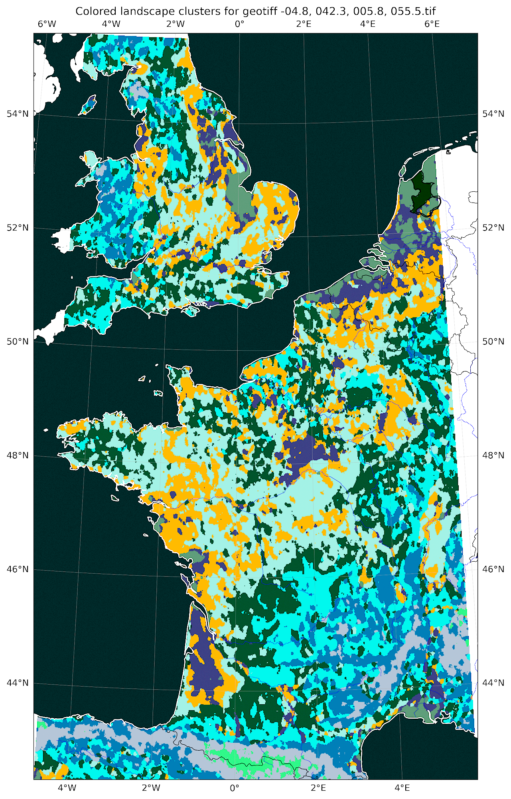

# Landscape Clustering by FFT footprints
**TL;DR** → This project clusters familiar shaped geographic regions. Those should be easily viewable in Google Earth Pro. 

## Why? Curiosity.

I was on vacation in Scotland where I instantly fell in love with the landscape. On my various vacations in Germany I got the impression that there must be kinds of landscapes similar to the diverse Scottish ones across Europe. That created the idea behind the project:

##### Intuitive Description

How to find regions across the world that "feel" the same.

##### More Factual Description

An exploratory geographic analysis. To effortlessly cluster comparable landscapes that share a common height profile frequency spectrum. 

## Data Sources

The DEM-Data can be obtained from opentopography.org. There’s asecondary notebook inside this repository that will download **[Copernicus GLO-90 DEM Data](https://portal.opentopography.org/raster?opentopoID=OTSDEM.032021.4326.1)**[^1] .

------

Legal notes:

Produced using Copernicus WorldDEM-30 © DLR e.V. 2010-2014 and © Airbus Defence and Space GmbH 2014-2018 provided under COPERNICUS by the European Union and ESA; all rights reserved.

The organisations in charge of the Copernicus programme by law or by delegation do not incur any liability for any use of the Copernicus WorldDEM-30.

## How does it work

I’ll put images here for illustration purposes.

1. Retrieve DEM height maps
2. Split the height maps into quadratic tiles of the same area
3. Recenter the average height for each tile to 0 (to prevent different clusters for similar landscapes in different heights)
4. FFT (Fast Forier Transform) of the height maps
5. Averaging a given number of rings inside the FFT, creating an average amplitude for various distances
6. Repeating the previous steps for all DEM maps
7. Clustering the ring averages across all DEM maps
8. Filter (mode) for a given radius to mitigate very granular clusters
9. Assigning colors to the labels and interpolating colored maps out of the data
10. Writing the data as GeoTIFFs
11. Display ortographic plots inside the notebook 

## How does it perform

Excellent! While exploring the results as an overlay in Google Earth Pro one can really experience the intrinsic relation inside the clusters. However there are half a dozen parameters to fine tune the result to any taste.  

So this tool won’t always spit out the perfect kind of map, but rather let’s you explore the topography at hand in a new way.

Please see the results at the end of the readme to get a feeling for what the analysis looks like.

## How to use

**TL;DR** → Have GeoTIFF files in a "input_geotiffs" called subfolder, have another subfolder at root level called "output_label_images" for the results, run the notebook, enjoy results.

#### Prerequisites

- There must be two subfolders in the main folder called **input_geotiffs** and **output_label_images**.
- As for now the geotiffs have to be in EPSG:4326 (WGS84) ➞ I *will* implement handling of all geographic (unprojected) coordinate systems[^2].
- The geotiffs must have only one channel (height data) which is common for DEM data.

##### Libraries needed to run

Please look into the **requirements.txt** inside this repository for the complete list.

##### Settings

There is a python cell very much at the top of the notebook preceded by a markdown block that tells you about the settings. 

### How the notebooks are divided

#### Primary notebook

- The one that creates the clusters in the abovementioned formats (main_notebook.ipynb)

#### Secondary notebooks

- One to load DEM data (secondary_dem_retriever.ipynb)
- ~~One to create the SVG files from the found clusters~~

## Results

## What’s new

This is a code refacoring of my original algorithm created in late 2024. Since then I had intense courses in python and related topics. So it was time to improve the code in many regards:

- **No more hardcoding:** Height data is now directly loaded via API (unless it’s already been downloaded) as GeoTIFFs.
- There are supposed to be a few different kind of outputs 
  1. **RGB GeoTIFFs** that depict the created clusters visually. **Done**
  2. **KML Files** (Keyhole Markup Language) that refer to the GeoTIFFs above. These files are optional as the GeoTIFFs should already have sufficient metadata to be loaded into Google Earth Pro directly. **TBD**
  3. **SVG Contours** that are vector data (instead of pixel data like GeoTIFFs), to be used in illustrative software like Adobe Illustrator, McNeel Rhino or Adobe Photoshop. The final purpose is to create nicer illustrations for this project, which I will add to this readme in the future. **TBD**
- Support for configuration files:
  All settings, like the number of clusters, original image coordinates and so on were hardcoded into the original notebook. With this new version there’ll be configuration files (JSON) that summarize the settings to be used by the notebook. **Preparing**

## What cannot be achieved (, yet)

While it is quite fascinating to see that the clusters found by the algorithm indeed appear similar in their topographical structure, there are, of course, aspects that are neglected in this approach entirely:

- Flora and fauna
- Climate
- Soil types
- And more meta aspects like
  - cultural ones like
    - the people
    - the language
  - civilization related
    - typical infrastructure
    - signposts
    - population density
    - architecture

Including those, would very much likely result in clusters that are country specific, unless the scale of some of the features is reduced again. In plain english that means: There’s no place like Scotland, except Scotland. :-)

## Footnotes

[^1]: © DLR e.V. 2010-2014 and © Airbus Defence and Space GmbH 2014-2018 provided under COPERNICUS
[^2]: Feature to be added: Handling of all geographic coordinate systems
